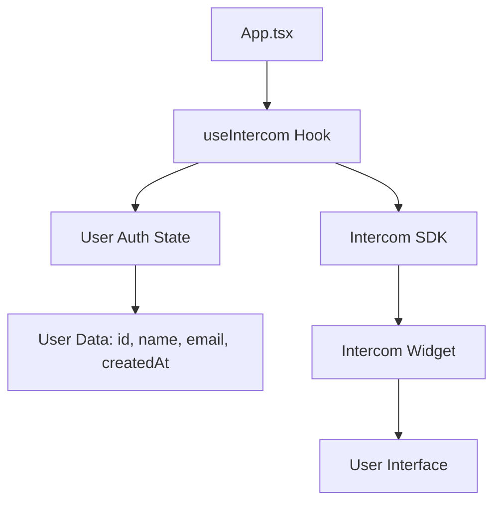
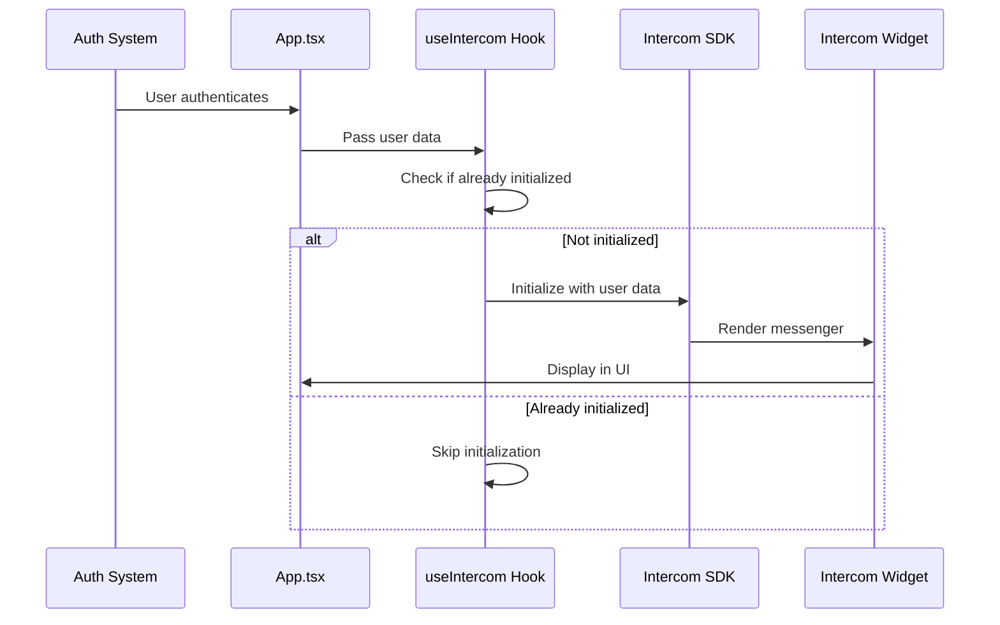

# Design Document: Intercom Messenger Integration

## Overview

This design implements Intercom Messenger integration into the React/TypeScript application using the official @intercom/messenger-js-sdk. The solution provides a custom React hook for managing Intercom initialization and lifecycle, ensuring the messenger widget is available to authenticated users throughout their session while maintaining proper cleanup and avoiding duplicate instances.

The implementation will be lightweight and non-intrusive, initializing Intercom at the application root level and automatically handling user authentication state changes.

## Architecture

### High-Level Architecture



### Component Structure

1. **useIntercom Hook** - Custom React hook that encapsulates Intercom initialization logic
2. **App.tsx Integration** - Root-level integration point for Intercom
3. **Type Definitions** - TypeScript interfaces for user data and Intercom configuration

### Design Decisions

**Decision 1: Custom Hook Pattern**
- Rationale: Encapsulates Intercom logic in a reusable, testable hook that follows React best practices
- Alternative considered: Direct initialization in App.tsx (rejected due to lack of reusability and harder testing)

**Decision 2: Root-Level Integration**
- Rationale: Initializing at the App.tsx level ensures Intercom is available throughout the entire application lifecycle
- Alternative considered: Component-level integration (rejected as it would require prop drilling and multiple initializations)

**Decision 3: Conditional Initialization**
- Rationale: Only initialize Intercom when user data is available to avoid errors and unnecessary API calls
- Alternative considered: Always initialize with anonymous users (rejected as requirements specify authenticated users only)

**Decision 4: Single Initialization Guard**
- Rationale: Prevent duplicate Intercom instances by tracking initialization state
- Alternative considered: Allow re-initialization (rejected due to potential memory leaks and duplicate widgets)

## Components and Interfaces

### 1. Type Definitions

**File:** `src/types/intercom.ts`

```typescript
export interface IntercomUser {
  id: string;
  name: string;
  email: string;
  createdAt: number; // Unix timestamp in seconds
}

export interface IntercomConfig {
  app_id: string;
  user_id: string;
  name: string;
  email: string;
  created_at: number;
}
```

### 2. useIntercom Hook

**File:** `src/hooks/useIntercom.ts`

**Purpose:** Manages Intercom SDK initialization and lifecycle

**Interface:**
```typescript
function useIntercom(user: IntercomUser | null): void
```

**Behavior:**
- Accepts user data or null
- Initializes Intercom when user data is provided
- Prevents duplicate initialization
- Handles cleanup on unmount
- Gracefully handles errors

**Key Logic:**
- Uses `useEffect` to respond to user state changes
- Maintains a ref to track initialization state
- Only initializes once per user session
- Logs errors without breaking the application

### 3. App.tsx Integration

**File:** `src/App.tsx`

**Changes:**
- Import and invoke `useIntercom` hook
- Pass user authentication state to the hook
- No visual changes to existing UI

## Data Models

### User Data Flow



### User Data Mapping

| Application Field | Intercom Parameter | Type | Required |
|------------------|-------------------|------|----------|
| user.id | user_id | string | Yes |
| user.name | name | string | Yes |
| user.email | email | string | Yes |
| user.createdAt | created_at | number | Yes |
| (constant) | app_id | string | Yes |

## Error Handling

### Error Scenarios

1. **Missing User Data**
   - Condition: User object is null or undefined
   - Handling: Skip initialization, no error thrown
   - User Impact: Intercom widget not displayed

2. **Invalid User Data**
   - Condition: User object missing required fields
   - Handling: Log warning, skip initialization
   - User Impact: Intercom widget not displayed

3. **SDK Initialization Failure**
   - Condition: Intercom SDK throws error during initialization
   - Handling: Catch error, log to console, continue app execution
   - User Impact: Intercom widget not displayed, app continues normally

4. **Network Issues**
   - Condition: Intercom CDN unreachable
   - Handling: SDK handles internally, app unaffected
   - User Impact: Intercom widget may not load, app continues normally

### Error Handling Strategy

```typescript
try {
  Intercom({
    app_id: 'xu0gfiqb',
    user_id: user.id,
    name: user.name,
    email: user.email,
    created_at: user.createdAt,
  });
} catch (error) {
  console.error('Failed to initialize Intercom:', error);
  // Application continues without Intercom
}
```

## Testing Strategy

### Unit Tests

**File:** `src/hooks/useIntercom.test.ts`

Test cases:
1. Hook initializes Intercom when valid user data is provided
2. Hook does not initialize when user is null
3. Hook does not initialize twice for the same user
4. Hook handles missing user fields gracefully
5. Hook catches and logs initialization errors
6. Hook cleans up on unmount (if cleanup is implemented)

### Integration Tests

Test cases:
1. Intercom widget appears in the DOM after user authentication
2. Intercom does not appear when user is not authenticated
3. User data is correctly passed to Intercom SDK
4. Application continues to function if Intercom fails to load

### Manual Testing Checklist

- [ ] Verify Intercom widget appears after user login
- [ ] Verify widget persists across page navigation
- [ ] Verify user information is correctly displayed in Intercom dashboard
- [ ] Verify application works normally if Intercom is blocked by ad blocker
- [ ] Verify no duplicate widgets appear
- [ ] Verify widget does not appear for unauthenticated users

## Implementation Notes

### Dependencies

- **@intercom/messenger-js-sdk**: Official Intercom SDK for JavaScript applications
- Version: Latest stable version
- Installation: `npm install @intercom/messenger-js-sdk`

### Configuration

- **App ID**: `xu0gfiqb` (hardcoded as per requirements)
- **Environment**: Works in all environments (development, staging, production)

### Future Enhancements

1. **Environment-based App ID**: Use different Intercom app IDs for different environments
2. **Custom Launcher**: Implement custom button to trigger Intercom
3. **Event Tracking**: Track custom events in Intercom
4. **User Attributes**: Pass additional user metadata to Intercom
5. **Shutdown Method**: Implement proper Intercom shutdown on logout

### Assumptions

1. User authentication system exists and provides user data in the expected format
2. User creation timestamp is available in Unix timestamp format (seconds)
3. Application has internet connectivity for Intercom CDN
4. No existing Intercom integration in the codebase
